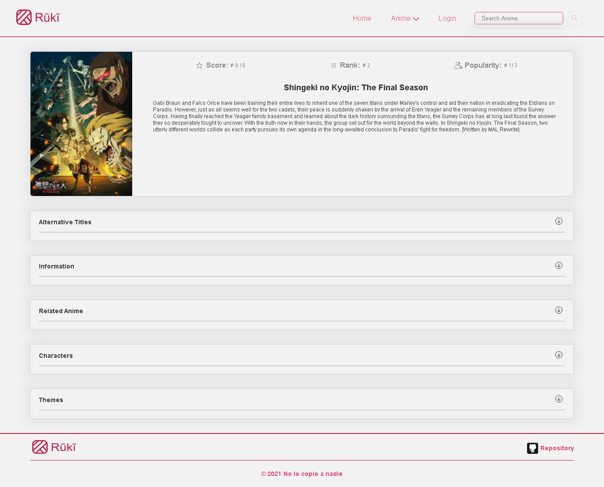

# Rūkī

Rūkī es un sistema web que te brinda información sobre todos los animes de temporadas pasadas o presentes, además de información de cada anime descripción de su trama, genero, entre otros datos. Todos los datos son servidos desde la api de [Jikan API](https://jikan.moe/) que es toma la base de datos de [MyAnimeList.net](MyAnimeList.net).



## Tecnologias utilizadas

- [ReactJs](https://reactjs.org/).
- [Webpack](https://webpack.js.org/).
- [Babel](https://babeljs.io/).
- [Sass](https://sass-lang.com/).
- [ESLint](https://eslint.org/).

## Building and running on localhost

First install dependencies:

```sh
npm install
```

To run in hot module reloading mode:

```sh
npm start
```

To create a production build:

```sh
npm run build-prod
```

To create a development build:

```sh
npm run build-dev
```

## Running

Open the file `dist/index.html` in your browser

## Credits

Made with [createapp.dev](https://createapp.dev/)
